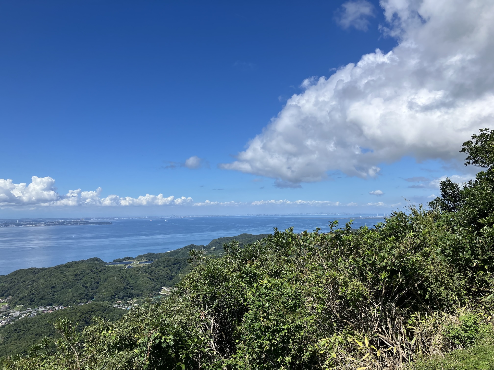
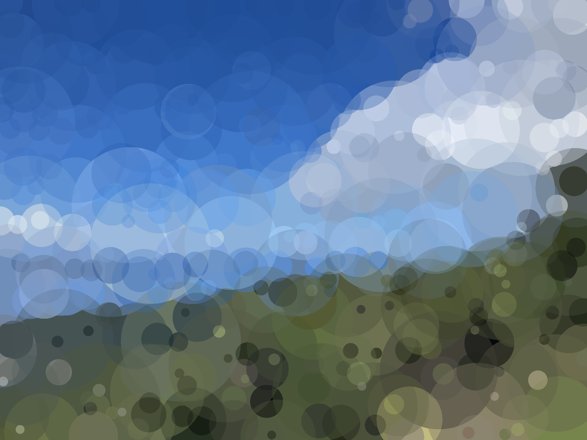

# circle-splatting

入力画像を複数の色付き円などの重なり合わせに変換する C++ 製ツール

| Input | Output |
| :---: | :---:|
|  |  |

## 概要

元の画像を入力すると，色付き円など指定した図形の組み合わせでその画像を再現しようと試みます．
各図形の位置，半径，色は勾配法によって最適化されます．

## 動作環境

* **C++ コンパイラ**：C++ 20 対応
* **OpenCV**：4.x
* **CMake**：3.10 以上

## ビルド方法

CMake を使用してビルドします．

```bash
mkdir build
cd build
cmake ..
make
```

## 使い方

ビルド後に生成された `circle-splatting` を実行します．

### 基本コマンド
`./circle-splatting -i input.jpg -o output.png`

### オプション一覧

| オプション | 説明 | デフォルト値 |
| --- | --- | --- |
|`-i`，`--input`|入力画像のパス（必須）|-|
|`-o`，`--output`|出力画像のパス（必須）|-|
|`-m`，`--mode`|形状（`circle`，`square`，`diamond`，`triangle-up`，`triangle-down`，`hexagon`）|`circle`|
|`-s`，`--shapes`|使用する図形の数|`400`|
|`-t`，`--iter`|反復回数（多いほど高精度）|`1000`|
|`-r`，`--max-radius`|図形の**初期**最大半径<b>※</b>|`20`|
|`-s`，`--seed`|乱数シード|`123456789`|


**※ 半径の指定について** 高速化のため，画像は内部的に長辺が 200 px になるように縮小されて処理されます．そのため，縮小後の画像上でのピクセル数としてこのパラメータは解釈されます．（例：デフォルトの `20` は，画像の長辺の 1/10 の大きさです）（円以外の場合，外接円の半径がこの値に対応します）

## ライセンス

本ソフトウェアは [MIT License](LICENSE) の下で公開されています．
